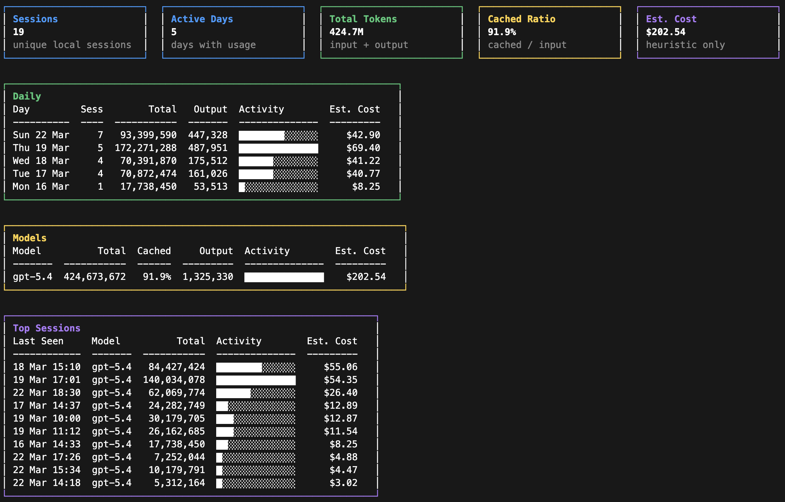

# Local Codex Usage Viewer

Local Codex Usage Viewer is a small terminal tool that scans local Codex session logs and reconstructs usage without relying on hosted analytics.

It reads the files under `~/.codex` or `$CODEX_HOME`, rebuilds token deltas from local session JSONL logs, and renders a terminal dashboard or JSON report.



## Who Is This For?

This is for users and companies that have Codex analytics turned off but still want to track usage in a private, local-only way from Codex logs.

## Features

- Offline usage reconstruction from local Codex logs.
- Styled terminal dashboard with progress while scanning.
- First-class `daily`, `weekly`, `monthly`, and `sessions` reports.
- Helpful CLI guidance via `--help` and `help <command>`.
- Experimental limit progress from local `codex.rate_limits` websocket events.
- `--watch` mode for live refresh.
- `--json` mode for scripting and automation.
- `--censored` mode to hide thread titles.
- Model breakdowns, session summaries, daily usage, heuristic cost estimates, and a rough energy/tree-offset signal.

## Requirements

- Python 3.10+
- Local Codex logs in `~/.codex` or another directory passed via `--root`

## Installation

If you only cloned the repo, `cuv` will not exist yet. You must install it from a terminal, or run `python3 codex_usage.py` directly from the checkout.

### Recommended from a local clone

This is the smoothest setup if you want `cuv` working immediately in the current shell:

If you do not have `pipx` yet on macOS:

```bash
brew install pipx
pipx ensurepath
```

```bash
git clone https://github.com/uricorn/local-codex-usage-viewer.git
cd local-codex-usage-viewer
source ./install.sh
```

That installs the tool with `pipx`, adds `~/.local/bin` to the current shell if needed, and leaves `cuv` ready to run immediately.

### `pipx` from GitHub

Creates a global `cuv` command in an isolated environment.

```bash
pipx install git+https://github.com/uricorn/local-codex-usage-viewer.git
```

Then run:

```bash
cuv
```

If `cuv` is still not found afterwards:

```bash
pipx ensurepath
```

Then open a new terminal, or run `hash -r` in your current shell.

To upgrade an existing install to the latest GitHub version:

```bash
pipx install --force git+https://github.com/uricorn/local-codex-usage-viewer.git
```

Then verify:

```bash
cuv --version
```

### Fallback: `pip`

Installs into the current Python environment.

```bash
python3 -m pip install git+https://github.com/uricorn/local-codex-usage-viewer.git
```

If the command is still not found afterwards, the Python environment's script directory is probably not on your `PATH`.

### Without installing

Runs directly from the checkout and does not create a shell command:

```bash
python3 codex_usage.py
```

## Usage

```bash
cuv
```

Scans the default Codex home directory and renders the terminal dashboard with compact daily, weekly, and monthly trend panels. When local limit snapshots are available in `logs_1.sqlite`, the dashboard also shows a `Limit Progress (Experimental)` panel.

```bash
cuv --help
cuv help daily
```

Shows general CLI help or focused help for a specific report command.

```bash
cuv daily --days 7
```

Shows a day-by-day table with sessions, tokens, cached ratio, and optional estimated cost. The dashboard summary cards also include estimated energy and a friendly tree-offset equivalent.

```bash
cuv weekly --days 90
```

Shows a week-by-week table using local Monday-based week buckets.

```bash
cuv monthly --all
```

Shows a month-by-month table across all locally available history.

```bash
cuv sessions --days 7 --censored
```

Shows the top local sessions in the selected window. With `--censored`, thread titles stay hidden.

```bash
cuv --days 7
```

Limits the report to the last 7 days instead of the default rolling window.

```bash
cuv --watch 5
```

Refreshes the dashboard every 5 seconds so you can keep it open while working.

```bash
cuv --json > usage.json
```

Writes machine-readable JSON instead of the dashboard, which is useful for scripts and automation. The JSON includes a top-level `limits` object when a local rate-limit snapshot is available.

```bash
cuv --json | jq '.limits'
```

Prints only the current experimental local limit snapshot from JSON output, which is useful when you want to inspect rate-limit progress separately from the rest of the usage report.

```bash
cuv monthly --json
```

Writes a focused machine-readable monthly report with a `rows` array instead of the full dashboard payload.

```bash
cuv weekly --json
```

Writes a focused machine-readable weekly report with a `rows` array instead of the full dashboard payload.

```bash
cuv --all --no-cost
```

Scans all locally available history and hides heuristic cost estimates.

```bash
cuv --censored
```

Hides thread titles and the local source path so the output is safer to share. Limit progress stays visible because it comes from local rate-limit metadata, not thread text.

```bash
cuv --root /path/to/codex-home
```

Scans a different Codex home directory instead of the default `~/.codex` or `$CODEX_HOME`.

## Output Notes

- Estimated cost is heuristic-only.
- Cost values prefixed with `~` include fallback prices guessed from the nearest known model family.
- Estimated energy and tree offset are heuristic-only.
- Limit progress is experimental, best-effort, and comes from local `codex.rate_limits` websocket events in `logs_1.sqlite`.
- Limit progress may be missing if the local logs do not contain a recent rate-limit snapshot.
- The dashboard is useful for observability and rough comparisons, not billing reconciliation.
- `--censored` removes thread titles and hides the local source path from terminal and JSON output.

### Cost Heuristic Footnote

The cost estimate uses local token counts and the model prices in `PRICING` inside `codex_usage.py`.
Each tuple is:

```text
(input_token_rate, output_token_rate, cached_input_token_rate)
```

Rates are stored per token. To add a new official model price, divide the published per-1M token price by `1_000_000` and add the normalized model name:

```python
PRICING["gpt-example"] = (2.5e-6, 1.5e-5, 2.5e-7)
```

Use `None` for `cached_input_token_rate` when cached input has no separate published price. If a future GPT model is missing from the table, `cuv` falls back to the nearest known GPT model family and marks the displayed cost with `~`; JSON output also includes `has_guessed_cost`.

### Energy Heuristic Footnote

The energy card is intentionally rough. It is a token-weighted estimate, not a wall-power measurement:

```text
estimated_energy_wh =
  (non_cached_input_tokens * input_rate_wh)
  + (cached_input_tokens * cached_rate_wh)
  + (output_tokens * output_rate_wh)
```

Current default rates are:

- `input_rate_wh = 0.00025`
- `cached_rate_wh = 0.000025`
- `output_rate_wh = 0.00075`

The model multiplier then adjusts those base rates by family, with smaller models discounted and `pro`-tier models weighted higher.

The friendly tree equivalent converts the energy estimate into a rough offset time using:

- `400 gCO2e / kWh` grid intensity
- `22 kgCO2e / year` absorbed by one mature tree

This should be read as a rough relative signal for "more vs. less", not a literal environmental accounting figure.

## Codex Integration

For repository-local Codex behavior, see:

```text
AGENTS.md
```

For an installable Codex skill, this repository includes:

```text
skills/local-codex-usage-viewer/SKILL.md
```

To install that skill into Codex, place it under:

```text
$CODEX_HOME/skills/local-codex-usage-viewer
```

That gives Codex a reusable skill for local usage questions even outside this repository.

## Credit

This project is directly inspired by CodexBar's local-log scan for Codex usage.

- [CodexBar docs: cost usage local log scan](https://github.com/steipete/CodexBar/blob/main/docs/codex.md#cost-usage-local-log-scan)
- [CostUsageScanner.swift](https://github.com/steipete/CodexBar/blob/main/Sources/CodexBarCore/Vendored/CostUsage/CostUsageScanner.swift)
- [CostUsageScanner+Timestamp.swift](https://github.com/steipete/CodexBar/blob/main/Sources/CodexBarCore/Vendored/CostUsage/CostUsageScanner%2BTimestamp.swift)
- [CostUsagePricing.swift](https://github.com/steipete/CodexBar/blob/main/Sources/CodexBarCore/Vendored/CostUsage/CostUsagePricing.swift)

CodexBar is maintained by Peter Steinberger ([`steipete`](https://github.com/steipete)) and released under the MIT license. The parsing approach and pricing heuristics here were adapted from that work. See [NOTICE](NOTICE) for attribution details.
